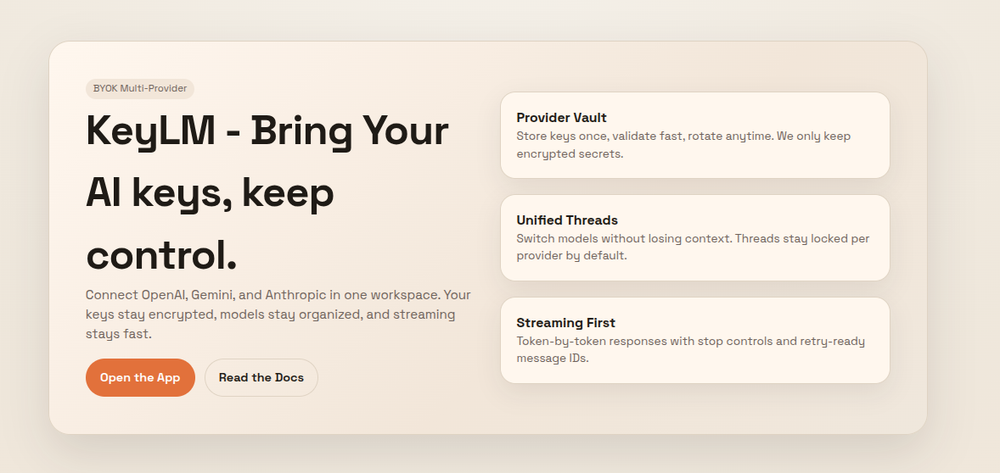

# KeyLM — Bring Your AI

**Your keys. Your models. Your control.**

KeyLM is a unified AI chat workspace where users can start with a shared Groq-powered free tier, then bring their own OpenAI, Gemini, or Anthropic API keys for full control. It keeps provider keys encrypted, discovers models automatically, saves threaded conversations, and streams responses in real time.

**Live App**: [keylm.shakilahmed.tech](https://keylm.shakilahmed.tech)

## ✨ Features

- **BYOK workspace** — connect and use your own OpenAI, Gemini, or Anthropic API keys.
- **KeyLM Free** — new users can chat through a shared Groq fallback with daily quotas.
- **Encrypted key storage** — provider keys are encrypted at rest and never exposed to the client.
- **Multi-provider chat** — switch providers and models without changing apps.
- **Auto model discovery** — fetch and cache model lists per connected provider key.
- **Threaded history** — save conversations, provider/model choices, settings, and token usage.
- **Streaming responses** — receive assistant replies through Server-Sent Events (SSE).
- **Usage visibility** — show prompt/output/total token usage when provider data is available.

## 🔐 Source Code Access

The KeyLM source code is maintained in the following repositories:

- **KeyLM Web**: [ahmedmshakil/KeyLM-BringYourAI](https://github.com/ahmedmshakil/KeyLM-BringYourAI.git)
- **KeyLM Android**: [ahmedmshakil/keylm_android](https://github.com/ahmedmshakil/keylm_android.git)

For source code access, collaboration, or review requests, please reach out via email at [info@shakilahmed.tech](mailto:info@shakilahmed.tech).

## 🧱 Tech Stack

- **Framework**: Next.js 16 App Router
- **Language**: TypeScript
- **UI**: React, CSS modules/global styles
- **Backend**: Next.js Route Handlers
- **Database**: PostgreSQL with Prisma ORM
- **Auth**: Supabase passwordless email auth + signed HTTP-only app sessions
- **Security**: AES-256-GCM encryption for provider API keys
- **Streaming**: Server-Sent Events (SSE)
- **AI Providers**: OpenAI, Gemini, Anthropic, and Groq free fallback
- **Containerization**: Docker + Docker Compose

## 👨‍💻 Author

**Shakil Ahmed**

- GitHub: [@ahmedmshakil](https://github.com/ahmedmshakil)
